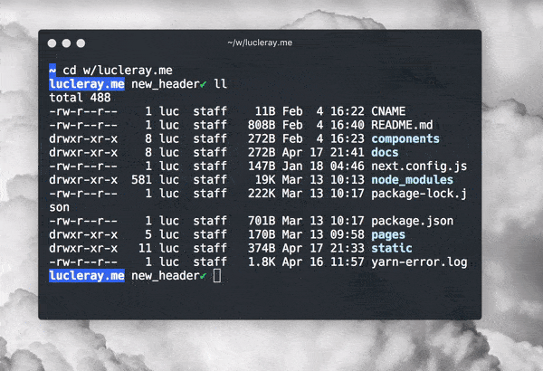

## hyper-opacity

* Simple configuration in `.hyper.js`
* Compatible with any theme
* Works on MacOS and Windows

<div align="center">
<p>

</p>
</div>

### Install

`hyper i hyper-opacity`

### Configure

Add a line to your hyper configuration (`~/.hyper.js`) :

```js
module.exports = {
  config: {
    // rest of the config
    opacity: 0.85
  }
  // rest of the file
}
```

### Configure the opacity for focused/unfocused windows

```js
module.exports = {
  config: {
    // rest of the config
    opacity: {
      focus: 0.9,
      blur: 0.5
    }
  }
  // rest of the file
}
```

<div align="center">
<p>

</p>
</div>

### More

**hyper-opacity** uses [BrowserWindow.setOpacity()](https://electronjs.org/docs/api/browser-window#winsetopacityopacity-windows-macos).
